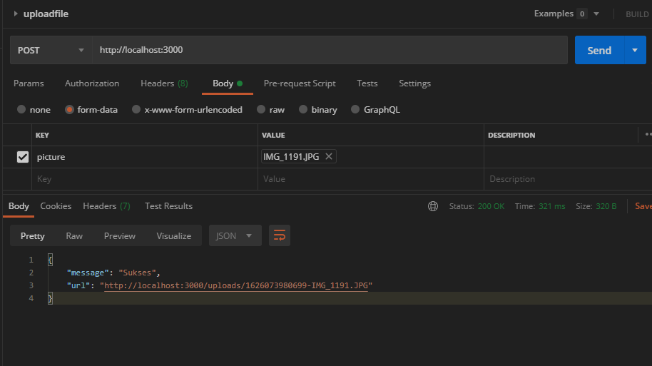
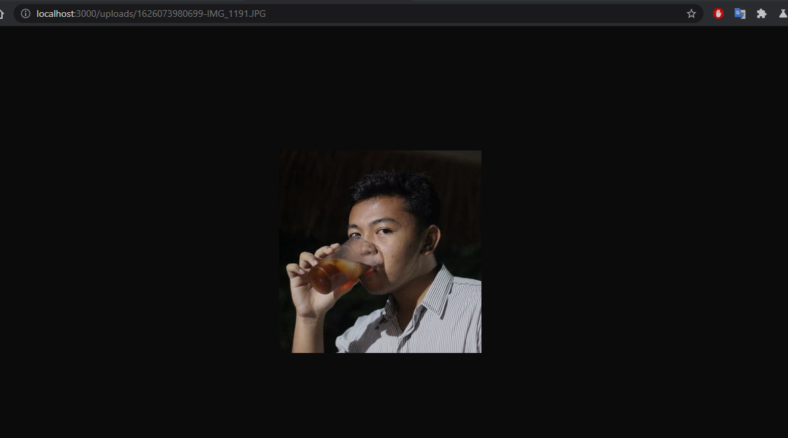

# compress-image-express

basic image compression using express js, multer, sharp

1. run `npm install` or `yarn`
2. run `nodemon index.js`
3. go to postman or insomnia
4. don't forget to use multipart/form-data in body
5. if upload success you should see

6. CTRL + click that link
7. Now you can see the result

### notes
1. don't use date.now instead date.now use uuid